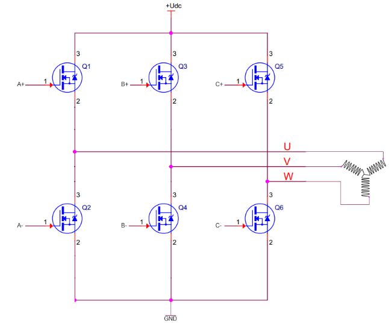
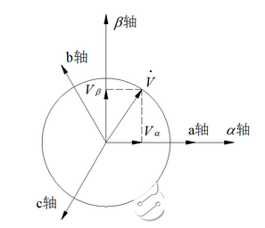

# 0、参考链接
- [灯哥教你写FOC算法教程](http://dengfoc.com/#/dengfoc/%E7%81%AF%E5%93%A5%E6%89%8B%E6%8A%8A%E6%89%8B%E6%95%99%E4%BD%A0%E5%86%99FOC%E7%AE%97%E6%B3%95/%E5%BA%8F%E4%B8%BA%E4%BB%80%E4%B9%88%E8%A6%81%E5%87%BA%E8%BF%99%E7%B3%BB%E5%88%97%E8%AF%BE%E7%A8%8B.md)
- https://zhuanlan.zhihu.com/p/399366217
- https://zhuanlan.zhihu.com/p/172484981

# 1、BLDC 驱动
直流无刷电机 (BLDC) 通常采用 PWM 调制模拟正弦波去控制电机；而永磁同步电机 (PMDM) 采用正弦波的方式控制。

如上图所示，交替开关 MOS管可以实现电机的转动，而这些交替开关的 MOS管是以极快的速度在周期性进行的，把这些周期性的开启和关断过程中联系起来，并且对其各个相进行观察，就可以得到三个相 A/B/C (U/V/W) 的电流随时间变换的曲线，如下图所示，它们之间存在 120度的相位差。

红色表示 A相电流的变化；绿色表示 B相电流的变化 ；蓝色表示 C相电流的变化 ；青色表示三相合成电流的变化 ； 三个矢量合成到一起，如下图所示

从上面不难看出，要想同时控制三个正弦波去控制电机是非常困难的，所以要对控制方式做一些简化，Clark变换就将控制的正弦波数量简化为两个。

# 2、Clark变换

Clark变换就是将 A、B、C相的电流映射到 α 和 β 轴上面。

如上图所示，我们将 a、b、c 轴通过三角函数变换到 α、β 轴上：

对于 α轴有： 

$$I_{\alpha }=i_{\alpha }-sin\left ( \frac{\pi }{6} \right )i_{b}-cos\left ( \frac{\pi }{3} \right )i_{c}$$
$$I_{\alpha }=i_{\alpha }-\frac{1}{2}i_{b}-\frac{1}{2}i_{c}$$

对于 β轴有：
$$I_{\beta }=cos\left ( \frac{\pi }{6} \right )i_{b}-cos\left ( \frac{\pi }{6} \right )i_{c}$$
$$I_{\beta }=\frac{\sqrt{3}}{2}i_{b}-\frac{\sqrt{3}}{2}i_{c}$$

写出矩阵的形式：
$$\begin{bmatrix}
I_{\alpha }\\ 
I_{\beta }
\end{bmatrix}=
\begin{bmatrix}
1 & -\frac{1}{2} & -\frac{1}{2}\\ 
0 & \frac{\sqrt{3}}{2} & -\frac{\sqrt{3}}{2}
\end{bmatrix}
\begin{bmatrix}
i_{a}\\ 
i_{b}\\ 
i_{c}
\end{bmatrix} \tag{1}$$

公式 (1) 是理想状态下用 $I_{\alpha }$ 和 $I_{\beta }$ 表示 $i_{a}$，$i_{b}$，$i_{c}$ 。但是实际上，假设 10A电流从 a相流入，那 b、c相流出的电流之和一定为 10A，遵循基尔霍夫电流定律（电路中任一个节点上，在任意时刻，流入节点的电流之和等于流出节点的电流之和）：
$$i_{a} + i_{b} + i_{c} = 0 $$

假设某时刻 a相的电流为 -1A，则 b、c相的电流分别为 $\frac{1}{2}$A：
$$\left\{\begin{matrix}
i_{a}=-1\\ 
i_{b}=\frac{1}{2}\\ 
i_{c}=\frac{1}{2}
\end{matrix}\right. \tag{2}$$

我们将(2)带入(1):
$$\begin{bmatrix}
I_{\alpha }\\ 
I_{\beta }
\end{bmatrix}=
\begin{bmatrix}
-\frac{3}{2}\\ 
1
\end{bmatrix}$$

# 3、Park变换

$$\begin{Bmatrix}
\\ 
\\ 

\end{Bmatrix}$$

$$\begin{Bmatrix}
\\ 
\\ 

\end{Bmatrix}\left\{\begin{matrix}
\\ 
\\ 

\end{matrix}\right.$$

$$\begin{vmatrix}
\\ 
\\ 

\end{vmatrix}$$

$$a^2=b^2+c^2$$
$$I_{a} = I_{b} + I_{c}$$
